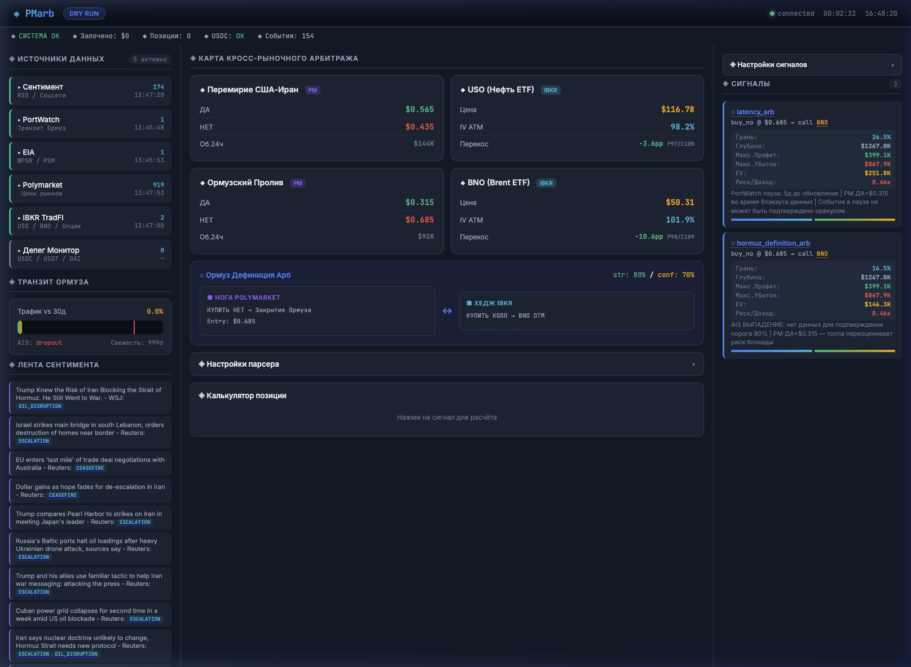

# PMarb — Prediction Market Arbitrage Terminal

Cross-market arbitrage engine exploiting structural inefficiencies between Polymarket prediction contracts and TradFi hedging instruments (IBKR options/ETFs).



## Architecture

```
┌─────────────────────────────────────────────────────────────┐
│                    Event Bus (async)                        │
├──────────┬──────────┬───────────┬──────────┬───────────────┤
│ Polymarket│ Sentiment│ PortWatch │   EIA    │  IBKR TradFi  │
│ Collector │ (RSS)    │ (IMF AIS) │ (WPSR)   │ (spot+options)│
├──────────┴──────────┴───────────┴──────────┴───────────────┤
│                  Analytics Engines                         │
│  ◇ Ceasefire Detector   — bilateral confirmation trap      │
│  ◇ Hormuz Definition    — 80% PortWatch threshold gap      │
│  ◇ Latency Exploitation — data publication schedule lag     │
├────────────────────────────────────────────────────────────┤
│                Signal Config (JSON)                        │
│        strategy toggles · thresholds · filters             │
├────────────────────────────────────────────────────────────┤
│              Dashboard API (FastAPI + WS)                  │
│         /api/state · /api/signal-settings · /ws            │
├────────────────────────────────────────────────────────────┤
│              Dashboard UI (index.html)                     │
│   arb map · signals · position calc · parser config        │
└────────────────────────────────────────────────────────────┘
```

## Strategies

| Strategy | Edge | Polymarket Leg | Hedge Leg |
|----------|------|---------------|-----------|
| **Fake Ceasefire** | Crowd overprices unilateral peace signals (bilateral required) | BUY NO on ceasefire | PUT on USO |
| **Hormuz Definition** | 80% traffic drop threshold vs real 40-60% attack impact | BUY NO on blockade | CALL on BNO |
| **Latency Arb** | Oracle can't prove event during data blackout → NO wins by default | BUY NO during gap | CALL on BNO |

## Features

- **5 data sources**: Polymarket (real-time), RSS sentiment (30s), PortWatch IMF (6h), EIA WPSR/PSM (1h), IBKR (30s)
- **Options chain**: ATM IV, 25-delta put/call IV, skew calculation via IBKR streaming
- **Risk metrics**: max profit/loss, risk/reward ratio, EV per signal
- **Signal config UI**: strategy toggles, thresholds, cooldowns — all via dashboard
- **Position calculator**: simulated sizing $100–$10K with breakeven probability
- **Parser config**: 19 keyword categories, filter thresholds, scoring weights

## Quick Start

### Prerequisites

- Python 3.11+
- IB Gateway or TWS (paper trading account)
- Polymarket wallet (Polygon network)
- EIA API key (free: https://www.eia.gov/opendata/register.php)

### Setup

```bash
# Clone
git clone git@github.com:YOUR_USER/pmarb.git
cd pmarb

# Env
python -m venv .venv
source .venv/bin/activate
pip install -e .

# Config
cp .env.example .env
# Edit .env — fill in your keys

# Run (dry-run mode)
python -m src.main run --dry-run
```

Dashboard: http://localhost:8877

### Configuration

- **`config.yaml`** — market slugs, instruments, poll intervals, risk limits
- **`.env`** — secrets (wallet keys, API keys, IBKR connection)
- **`signal_config.json`** — signal thresholds (auto-generated, editable via UI)

## Project Structure

```
PMarb/
├── config.yaml              # Markets, instruments, risk params
├── pyproject.toml            # Python dependencies
├── .env.example              # Template for secrets
│
├── src/
│   ├── main.py               # Entry point, event loop orchestrator
│   ├── config.py             # Settings loader (YAML + ENV)
│   ├── event_bus.py          # Async pub/sub event bus
│   ├── signal_config.py      # Persistent signal config store
│   ├── dashboard_api.py      # FastAPI + WebSocket server
│   │
│   ├── collectors/           # Data source collectors
│   │   ├── polymarket.py     # CLOB price polling
│   │   ├── sentiment.py      # RSS feed parser + keyword scorer
│   │   ├── portwatch.py      # IMF PortWatch AIS data
│   │   ├── eia.py            # EIA petroleum data
│   │   ├── tradfi.py         # IBKR spot + options chain
│   │   ├── scanner.py        # Polymarket market scanner
│   │   └── depeg.py          # Stablecoin depeg monitor
│   │
│   ├── analytics/            # Signal generation engines
│   │   ├── ceasefire.py      # Fake ceasefire detector
│   │   ├── hormuz.py         # Hormuz definition arb
│   │   └── latency.py        # Data latency exploitation
│   │
│   ├── execution/            # Order execution (dry-run / live)
│   │   ├── order_manager.py  # Position tracking
│   │   └── tradfi_exec.py    # IBKR order routing
│   │
│   ├── models/               # Data models & events
│   │   └── events.py         # EventType, ArbSignal, etc.
│   │
│   └── risk/                 # Risk management
│       └── risk_manager.py   # Pre-trade validation
│
├── dashboard/
│   └── index.html            # Single-page dashboard UI
│
├── tests/                    # Unit tests
│
└── docs/
    └── dashboard.png         # Dashboard screenshot
```

## Safety

- **DRY_RUN=true** by default — no real orders sent
- Pre-trade validation: instrument exists, session active, qty > 0, within limit bands
- Local rate limiting to prevent IBKR session termination
- All signals logged with raw data, timestamps, sequence numbers

## License

Private — Not for distribution.
